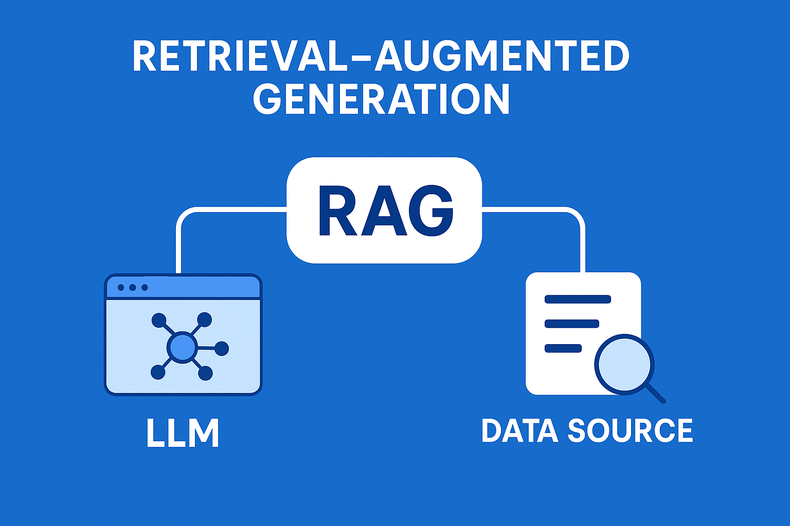
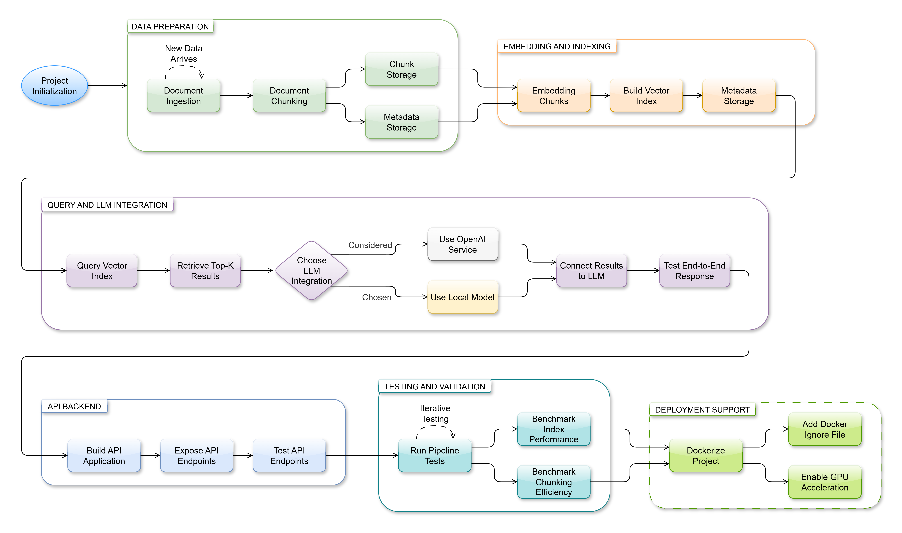

# RoT RAG Project



Generative AI systems, like **large language models (LLMs)**, are very effective at producing text responses. However, their outputs are often limited to the knowledge present in their training data, which can be weeks, months, or even years out of date. This may result in outdated or incorrect information, especially in a corporate context where specific knowledge about products or services is required.

**Retrieval-Augmented Generation (RAG)** addresses this limitation by combining an **LLM** with targeted external data. **RAG** allows the AI to generate responses based not only on its pre-trained knowledge but also on **up-to-date, domain-specific information**. This ensures that answers are more accurate, contextually relevant, and grounded in the latest available data.

## About RoT RAG Project

**The RoT RAG Project** implements a Python-based **RAG** pipeline. Documents are ingested and split into chunks, then embedded using **Hugging Face models** and indexed with **FAISS** for fast semantic search. 

A **FastAPI backend** exposes an API for querying the indexed documents using a local **Hugging Face LLM** for generating responses. The project includes example scripts for index building and query testing, and is fully **Docker-ready for deployment**. By integrating **RAG**, the system ensures that LLM-generated responses are enhanced with the most relevant and **up-to-date** information from the provided documents.



## Project Structure
```
ROT-RAG-PROJECT/
├── data/                    # Documents and generated artifacts
│ ├── chunks.json            # Generated text chunks
│ ├── faiss_index.bin        # FAISS index file
| ├── user_manual.pdf        # Main source
| ├── query_result.json      # Sample query results
| ├── test_cases.json        # questions & expected answers
│ ├── sample.pdf             # Example PDF document
│ └── test.txt               # Example TXT document
│
├── rag/                     # FastAPI application code (API layer)
│   ├── app.py                     # FastAPI app (serves RAG pipeline via API)
│   ├── llm_wrapper.py             # LLM interface
│   ├── query_faiss.py             # Query FAISS index
|   └── test_llm_query.py          # Example script to test LLM with retrieved passages
|
├── src/                     # Scripts for ingestion, embedding, evaluation
│ ├── embed_faiss.py               # Build FAISS index from chunks
│ ├── ingest.py                    # Process documents into chunks
│ └── eval_rag.py                  # Evaluate retrieval quality with test cases
│
├── tests/                   # Unit / integration tests
│   ├── performance/
│   |   ├── test_faiss_speed.py    # Performance testing for FAISS
│   |   └── test_chunks.json       # Test chunks for benchmarking
|   |   
|   └── quick_test.py           # Minimal test for the RAG pipeline
|
├── test_rag.py              # Root-level API test via HTTP (requests)
|
├── .gitignore
├── .dockerignore
├── Dockerfile               # Containerization support
├── LICENSE
├── pyproject.toml
├── README.md                # Project documentation
└── requirements.txt         # Python dependencies
```

## Setup Instructions

To run this project, make sure you have the following installed:

- **Python 3.13.7**
- **CUDA 12.6** (Optional: Required for GPU acceleration)

### 1. Clone the repository
```bash
git clone https://github.com/zbilgeozkan/rot-rag-project.git
cd rot-rag-project
```

### 2. (Optional) Create a virtual environment
```bash
python -m venv .venv
source .venv/bin/activate   # On Linux/Mac
.venv\Scripts\activate      # On Windows
```

### 3. Install dependencies
```bash
pip install -r requirements.txt
```

### 4. Add your documents
Place your `.pdf` or `.txt` files inside the `data/` directory.

### (Optional) Configure GPU
If you have a CUDA-compatible GPU, the pipeline will automatically use it for embeddings and LLM inference.
No API key is needed for local Hugging Face models.

### (Optional) Add OpenAI API Key
Create a `.env` file with your API key:
```bash
echo "OPENAI_API_KEY=your_api_key_here" > .env
```

## Usage

- ### Step 1: Ingest documents
```bash
python src/ingest.py
```

Splits documents into chunks and saves them in: `data/chunks.json`.

- ### Step 2: Build FAISS index
```bash
python src/embed_faiss.py
```

Creates the FAISS index: `data/faiss_index.bin` and metadata in `data/faiss_metadata.json`.

- ### Step 3: (Optional) Query the index -> FAISS-only
```bash
python rag/query_faiss.py
```
This script queries the FAISS index and saves results in `data/query_result.json`.

You can modify the query string inside `query_faiss.py`:

```python
results = faiss_query.query("Your question here")
```

* Example output:
```json
[
  {
    "text": "Example content from document...",
    "source": "sample.pdf",
    "page": 2,
    "title": "Example Title",
    "distance": 0.12345
  }
]
```

- ### Step 4: Test
```bash
python rag/llm_wrapper.py
```

- ### Step 5: Test LLM answers with retrieved passages
```bash
python rag/test_llm_query.py
```

This script:

1. Pulls top-k passages from FAISS for your question.

2. Gerates a detailed answer using the local Hugging Face LLM.

3. Prints the answer in the console.

* Example output:
```vbnet
Question: How do I wear the Gear VR headset?

Answer: Align your face and the foam cushion and put on the Gear VR. Caution! Do not walk or drive while wearing the Gear VR...
```

- ### Step 6: Run the API
```bash
uvicorn rag.app:app --reload
```
Then open http://127.0.0.1:8000/docs to test the API endpoints.

- ### Step 7: (Optional) Run in Docker
```bash
docker build -t rot-rag-project .
docker run -p 8000:8000 --env-file .env rot-rag-project
```

## Notes
- Replace `sample.pdf` and `test.txt` with your own content for meaningful results.

- Default embedding model: `all-mpnet-base-v2` (or any other HF model you prefer).

- LLM answers are generated locally using Hugging Face models.  
  - If you want to optionally use an external API (like OpenAI), you can do so by adding your API key in the `.env` file.

- Supports GPU acceleration if available. For large datasets, consider using `faiss-gpu`.

- You can also run this project in a container using the provided Dockerfile.

## Dependencies and Licenses

This project is released under the **MIT License**.  
It uses several third-party frameworks, libraries, and AI models.  
Full license texts for these dependencies are available in the `/THIRD_PARTY_LICENSES` folder.

| Library / Component | License | Source |
|----------------------|---------|--------|
| **Python Standard Libraries** (os, re, json, sys, pathlib, collections) | Python Software Foundation License | [Python](https://www.python.org/) |
| **NumPy** | BSD-3-Clause | [NumPy](https://github.com/numpy/numpy) |
| **SciPy** | BSD-3-Clause | [SciPy](https://github.com/scipy/scipy) |
| **Scikit-learn** | BSD-3-Clause | [scikit-learn](https://github.com/scikit-learn/scikit-learn) |
| **PyTorch (torch)** | BSD-3-Clause | [PyTorch](https://github.com/pytorch/pytorch) |
| **sentence-transformers** | Apache-2.0 | [sentence-transformers](https://github.com/UKPLab/sentence-transformers) |
| **transformers** | Apache-2.0 | [HuggingFace Transformers](https://github.com/huggingface/transformers) |
| **tokenizers** | Apache-2.0 | [HuggingFace Tokenizers](https://github.com/huggingface/tokenizers) |
| **huggingface-hub** | Apache-2.0 | [HuggingFace Hub](https://github.com/huggingface/huggingface_hub) |
| **faiss** | MIT | [FAISS](https://github.com/facebookresearch/faiss) |
| **PyPDF2** | BSD-3-Clause | [PyPDF2](https://github.com/py-pdf/PyPDF2) |
| **fastapi** | MIT | [FastAPI](https://github.com/tiangolo/fastapi) |
| **uvicorn** | BSD-3-Clause | [uvicorn](https://github.com/encode/uvicorn) |
| **pydantic** | MIT | [pydantic](https://github.com/pydantic/pydantic) |
| **requests** | Apache-2.0 | [requests](https://github.com/psf/requests) |
| **tqdm** | MPL-2.0 | [tqdm](https://github.com/tqdm/tqdm) |
| **safetensors** | Apache-2.0 | [safetensors](https://github.com/huggingface/safetensors) |
| **google/flan-t5-base** (LLM model) | Apache-2.0 | [HuggingFace Model](https://huggingface.co/google/flan-t5-base) |
| **all-MiniLM-L6-v2** (embedding model) | Apache-2.0 | [HuggingFace Model](https://huggingface.co/sentence-transformers/all-MiniLM-L6-v2) |
